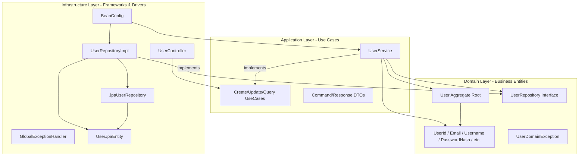
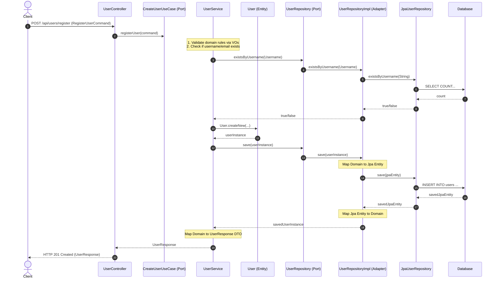
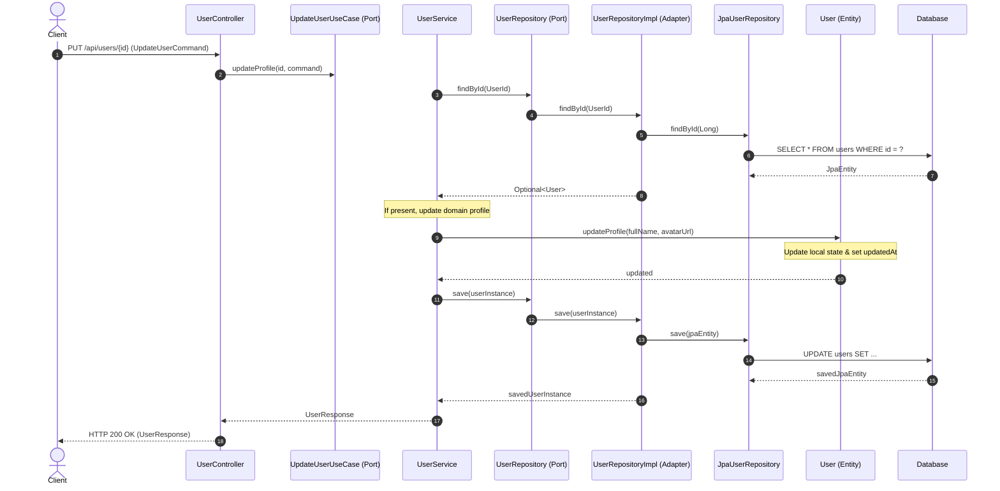
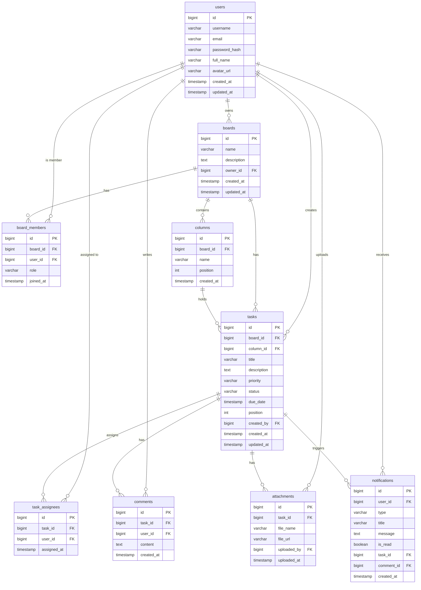

# Group Project - Review 1: Domain-Driven Design & User-Service Architecture

**Course**: MSS301  
**Project Name**: Kanban Board System  
**Service Covered**: User-Service (with overall Domain analysis)

---

## 1. Domain-Driven Design (DDD) Analysis

To establish a strong modular foundation for the microservice architecture, we have analyzed the overall Kanban system database and identified the **Aggregates**, **Entities**, and **Value Objects (VOs)** for all four core services.

### Overall DDD Classification Table

| Service | Aggregate Root | Entities | Value Objects (VOs) | Core Domain Rules / Invariants |
| :--- | :--- | :--- | :--- | :--- |
| **User Service** | `User` | `User` | `UserId`<br/>`Username`<br/>`Email`<br/>`PasswordHash`<br/>`FullName`<br/>`AvatarUrl` | - Email format must be valid (Regex verified).<br/>- Username must be non-empty and between 3-100 characters.<br/>- Avatar URL length must not exceed 500 characters. |
| **Board Service** | `Board` | `Board`<br/>`Column`<br/>`BoardMember` | `BoardId`<br/>`BoardName`<br/>`ColumnId`<br/>`ColumnName`<br/>`BoardMemberId`<br/>`Role` (OWNER, MEMBER) | - A Board must have at least one column (default columns).<br/>- Only the Board Owner can invite members or delete the board.<br/>- Column position must be positive and unique within the board. |
| **Task Service** | `Task` | `Task`<br/>`Attachment`<br/>`Comment`<br/>`TaskAssignee` | `TaskId`<br/>`TaskTitle`<br/>`TaskDescription`<br/>`Priority` (LOW, MEDIUM, HIGH)<br/>`Status` (TODO, IN_PROGRESS, DONE)<br/>`AttachmentId`<br/>`CommentId` | - Task status must align with valid board column IDs.<br/>- Due date cannot be in the past when creating a task.<br/>- File attachments must not exceed storage limits. |
| **Notification Service** | `Notification` | `Notification` | `NotificationId`<br/>`NotificationType`<br/>`NotificationTitle`<br/>`NotificationMessage` | - Notifications must target a valid UserId.<br/>- Read status defaults to `false`. |

---

## 2. User-Service Architecture & Package Structure

The `User-Service` is structured following the **Clean Architecture** (Ports and Adapters / Hexagonal) paradigm, ensuring complete isolation of the business Domain from frameworks (Spring Boot, Hibernate) and external infrastructure (PostgreSQL, Eureka).

### Package Layout
```
org.kanban.userservice
├── domain (Pure Business Logic)
│   ├── model
│   │   ├── User.java (Aggregate Root & Entity)
│   │   ├── UserId.java (Value Object)
│   │   ├── Username.java (Value Object)
│   │   ├── Email.java (Value Object)
│   │   ├── PasswordHash.java (Value Object)
│   │   ├── FullName.java (Value Object)
│   │   └── AvatarUrl.java (Value Object)
│   ├── repository
│   │   └── UserRepository.java (Domain Repository Interface / Port)
│   └── exception
│       └── UserDomainException.java (Domain-specific Exceptions)
│
├── application (Use Cases / Coordination)
│   ├── dto
│   │   ├── RegisterUserCommand.java (Registration Request payload)
│   │   ├── UpdateUserCommand.java (Profile Update Request payload)
│   │   └── UserResponse.java (Data Transfer Output payload)
│   ├── port
│   │   └── in
│   │       ├── CreateUserUseCase.java (Input Port for creating user)
│   │       ├── UpdateUserUseCase.java (Input Port for updating user)
│   │       └── QueryUserUseCase.java (Input Port for querying user)
│   └── service
│       └── UserService.java (Application Service executing use cases)
│
└── infrastructure (External Frameworks & Adapters)
    ├── adapter
    │   ├── in
    │   │   └── web
    │   │       ├── UserController.java (REST Endpoint Controller)
    │   │       └── exception
    │   │           └── GlobalExceptionHandler.java (Global Exception Rest Handler)
    │   └── out
    │       └── persistence
    │           ├── UserJpaEntity.java (JPA Database Mapping Entity)
    │           ├── JpaUserRepository.java (Spring Data JPA Interface)
    │           └── UserRepositoryImpl.java (Outbound Persistence Adapter)
    └── config
        └── BeanConfig.java (Spring Dependency Injection Configurations)
```

### Architecture Diagram
The diagram below shows the dependencies flowing inwards. Infrastructure depends on Application and Domain, while Domain depends on nothing.



---

## 3. Communication Diagrams (Use Case Flows)

These sequence diagrams demonstrate how request objects and data flow through the Clean Architecture layers.

### Case 1: User Registration (Creating User)
This flow validates input formatting, checks for uniqueness in the database, maps variables into Domain Value Objects, instantiates the domain model, saves via the adapter, and returns a sanitized DTO response.



### Case 2: User Profile Update
This flow retrieves the existing user by ID, executes the state transition within the Domain Entity itself (ensuring encapsulation), saves the modified entity to the database, and returns the updated DTO representation.



---

## 4. Database Schema Design (Database Diagram)

The following entity-relationship diagram shows the relational schema for the complete database, emphasizing the central role of the `users` table and its foreign key associations.


